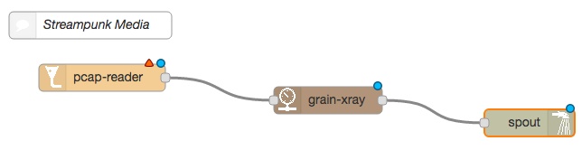

# Dynamorse

IT swiss army knife for professional media infrastructure and production. This is a *prototype* [Node.js](http://nodejs.org/) application that demonstrates:

* Putting the [Joint Taskforce for Networked Media](http://www.jt-nm.org)'s [Reference Architecture](http://www.jt-nm.org/RA-1.0/index.shtml) to work - streaming professional quality media with support for identity, timing and [NMOS](http://www.nmos.tv) [registration and discovery](https://github.com/AMWA-TV/nmos-discovery-registration);
* Applying [Internet of Things](https://en.wikipedia.org/wiki/Internet_of_things) concepts (IBM's [Node-RED](http://nodered.org)) to running media infrastructure on commodity IT systems, changing traditional infrastructure into drag-and-drop interfaces and JSON REST APIs;
* Using [reactive streams](http://www.reactive-streams.org/) concepts from big data to manage, monitor and balance collaborative resources, including CPU load. Reactive streams are similar in concept to the [adaptive bitrate streams](https://en.wikipedia.org/wiki/Adaptive_bitrate_streaming) commonly used in streaming media delivery.

The name _dynamorse_ is a reference to dynamic morse code - still a stream of information but conveyed and controlled dynamically. With dynamorse, you can create streaming workflows on-the-fly by building pipelines that connect inputs (_funnels_) to outputs (_spouts_) via transformations (_valves_) under the control of _fittings_. Everything is measured in real time by a set of _gauges_. Everything that flows down a dynamorse pipe is an NMOS _grain_ and every pipe contains an NMOS _flow_.

Dynamorse can now be installed on a Raspberry Pi.

<!-- START doctoc generated TOC please keep comment here to allow auto update -->
<!-- DON'T EDIT THIS SECTION, INSTEAD RE-RUN doctoc TO UPDATE -->
**Table of Contents**  *generated with [DocToc](https://github.com/thlorenz/doctoc)*

- [Dynamorse](#dynamorse)
  - [Funnels and spouts](#funnels-and-spouts)
  - [Valves](#valves)
  - [Fittings](#fittings)
  - [NMOS-inside](#nmos-inside)
  - [Redioactive](#redioactive)
  - [Watchful eye](#watchful-eye)
- [Getting started](#getting-started)
  - [Installation](#installation)
    - [Thread pool size](#thread-pool-size)
    - [Maturing - behind the scenes](#maturing---behind-the-scenes)
    - [Configuration nodes](#configuration-nodes)
  - [Examples to try](#examples-to-try)
    - [Example 1: Grain analyzer](#example-1-grain-analyzer)
    - [Example 2: Create a WAV file](#example-2-create-a-wav-file)
    - [Example 3: Encode an H.264 file](#example-3-encode-an-h264-file)
    - [Example 4: Send a WAV file as an NMOS flow](#example-4-send-a-wav-file-as-an-nmos-flow)
- [Support, status and further development](#support-status-and-further-development)
- [License](#license)

<!-- END doctoc generated TOC please keep comment here to allow auto update -->

### Funnels and spouts

Dynamorse treats all of the following kinds of media as streaming equals, turning them into _flows_ of _grains_:

* RTP streams - [TR-03](http://www.videoservicesforum.org/download/technical_recommendations/VSF_TR-03_DRAFT_2015-10-19.pdf), [ASPEN](http://aspen-community.com/) MPEG-TS;
* HTTP streams - [Arachnid](https://github.com/Streampunk/arachnid) (Streampunk Media defined) and MPEG-DASH;
* Raw files - H.264 bytestream, uncompressed - DPX-style, WAV;
* Container file formats - MXF, MOV;
* SDI streams - [Blackmagic Design](https://www.blackmagicdesign.com/) capture and playback devices, SMPTE 2022-6 (to follow - [issue](https://github.com/Streampunk/dynamorse/issues/12)).

Inputs are called _funnels_, outputs are called _spouts_.

### Valves

Create pipelines between the funnels and spouts and add _valves_ that transform the media as it flows. Transformations include:

* Encoding - convert uncompressed flows into compressed flows;
* Decoding - convert compressed flows into uncompressed flows;
* Converting - 10-bit to 8-bit, [RFC4175](https://tools.ietf.org/html/rfc4175) pixel groups to the common [V210](https://developer.apple.com/library/mac/technotes/tn2162/_index.html#//apple_ref/doc/uid/DTS40013070-CH1-TNTAG8-V210__4_2_2_COMPRESSION_TYPE) bytestream format, picture rescaling.
* Switch - switch between different inputs and grain boundaries.
* Graphics - pass each grain through a graphics programming library to, for example, add text or a bug.

### Fittings

The final piece of the dynamorse jigsaw puzzle are the pipe _fittings_ - a set of utilities that allow flows to be combined. This is the beginning of a journey towards the development of a stream-based creation and delivery tool, enabling _Immersive Social TV_ experiences that can be personalized to who is watching. Features include:

* Constrain the number of grains that flow down a pipe;
* Sequence a set of _flows_ one after the other;
* Set an alternative source in the event the expected source is not available;
* Rate limit or retime a flow;
* Apply a function that transforms either the metadata or payload flowing down a pipe;
* Control back-pressure.

### NMOS-inside

As well as being a means to move and process media data through a CPU/GPU and its connected interfaces, each running instance of dynamorse is a Neworked Media Open Specifications Registration and Discovery _node_. The implementation uses Streampunk Media's _ledger_ implementation of the NMOS specifications, also available as an open-source project. Each node has two NMOS _devices_:

1. _generic_ - funnels and spouts that expose flows via NMOS _senders_ and _receivers_. These resources are registered with any NMOS discovery interface found on the network.
2. _pipeline_ - All _flows_ and _sources_ within dynamorse are represented according to the NMOS data model and the _tags_ property of a flow is used to hold technical metadata.

### Redioactive

Dynamorse is ___redioactive___! This means that it adds a library of features to support [reactive streams](http://www.reactive-streams.org/) to the default behavior of [Node-RED](http://nodered.org). By default, Node-RED uses an event-based model where producers fire update events along the pipelines whether or not the consumer is ready to receive them. Alternatively, consumers are sat waiting for events because the producer has been throttled back.

With reactive streams support, the consumer signals to the producer when it is ready to receive more inputs, a process known as _back pressure_. The producer then pushes the next element down the pipe, which it may have optimistically buffered in advance. Producers and consumers can be chained together so that back pressure goes along the length of a pipe.

As an example, consider a file reader funnel on an SSD feeding a real-time display funnel. The file reader can read the picture data from the file at around twice real time, whereas the display can only cope with real-time data. With no back-pressure, the display consumer is overloaded and starts to drop frames. With back pressure, the display stops asking for frames when its buffer is full and the file-reader stops reading from the disk when its buffer is full. When the display's buffer starts to clear, it starts asking for frames again. As the file-reader satisfies the requests for frames and its buffer starts to empty, it starts to read another batch from the disk.

With real time streams and a slow consumer, at some point the producer's buffer will overflow and frames will be dropped. This is a symptom of a design problem with a pipeline or resource overload (see monitoring in the next section) that should not occur in normal operation. Errors are produced and can be monitored whenever a buffer is overloaded. Each dynamorse producer node (everything but the spouts) has a buffer size parameter.

Redioactive is designed to support pipelines that are more complex than just linking single producers to consumers:

* One, two or more consumers may be connected to a single producer. In this case, the producer will be throttled to run at the speed of the slowest consumer.
* One, two or more producers may be connected to a single consumer, in which case each producer receives the same back-pressure and the inputs to the consumer are interleaved.
* For more fine-grained control of the back-pressure, check out the fittings nodes.
* A combination of all of the above.

The design of redioactive was inspired by [highland.js](http://highlandjs.org/). Direct integration of highland with Node-RED did not seem easy to achieve at the time of implementation. Highland is still used behind the scenes for sub-grain processing.

### Watchful eye

Each dynamorse instance can send statistics to [influxdb](https://influxdata.com/time-series-platform/influxdb/), a time-series database that is optimized for storing and searching metrics information. The running instance sends metrics about the overall performance of the application, along with each Node-RED node sending details about how many grains it processed per second and how long it took to process each grain. This data can be mined and turned into reports or graphed in real time with tools such as  [Grafana](http://grafana.org/).

Dynamorse uses standard IT tools so that it fits alongside other metrics systems and applications in an enterprise IT environment. Combined with system monitoring tools that also work with the same toolsets, such as [collectd](https://collectd.org/), it is possible to monitor and respond to issues such as real-time streams about to dropping below real-time performance. Also, developers and testers can analyze performance by watching for memory leaks, buffer overflows, the impact of garbage collection etc..

## Getting started

### Installation

Install Node.js for your plarform. This software has been developed against the long term stable (LTS) release.

Install [Node-RED](http://nodered.org) for your platform. This software has been developed against the latest version.

Dynamorse depends on modules that use native C++ bindings that compile with node-gyp. To use these modules, you many need to install a C++ compiler and python on your system. On Windows, compilation has been tested using the community edition of Microsoft Visual Studio 2015. On Windows, node may need to be configured with:

    npm config set msvs_version 2015 --global

Run Node-red:

    node-red

Connect to the user interface via a web browser. By default, the UI runs on port `1880`, so use [http://localhost:1880](http://localhost:1880).

This package can be installed from the 'manage palette' option in the Node-RED menu. Alternatively in your Node-RED user directory, typically ~/.node-red, run

    npm install node-red-contrib-dynamorse-core

Other dynamorse packages can be installed from the 'manage palette' option or by npm command to provide all the nodes that are discussed here.

The choice of available nodes is provided down the left-hand-side. Each node is self-describing - click on it and it describes what it is and how to configure it in the info panel on the right-hand-side. Drag nodes out into the central flow designer panel and link them together by joining output ports to input ports.

Once you are happy with a design, hit the _Deploy_ button. This will send the flow to the dynamorse server and the server will attempt to run it. Check the debug tab on the right-hand-side for live debug messages and errors.

The NMOS Node API runs on port `3101` be default, so connect in another tab with [http://localhost:3101/x-nmos/node/v1.0/]([http://localhost:3101/x-nmos/node/v1.0/). Alternatively, connect over HTTP from a another browser on a different computer.

#### Thread pool size

The default thread pool size for _libuv_, an underlying component of Node.js, is only sufficient for 2 or 3 dynamorse nodes. To increase the size of the pool, set the `UV_THREADPOOL_SIZE` environment variable to a number higher than the default of `4`. For example, before running dynamorse on Mac/Linux:

    export UV_THREADPOOL_SIZE=32

On Windows:

    set UV_THREADPOOL_SIZE=32

#### Maturing - behind the scenes

Using the Node-RED drag-and-drop user interface to define a large scale infrastructure will quickly become tiresome. Fortunately, this UI is not the only way to work deploy and configure virtual infrastructure with Node-RED. Behind the scenes is a REST API -the [Node-RED Admin HTTP API](http://nodered.org/docs/api/admin/) - that can be used to inspect and deploy nodes. For example, to see the currently deployed flows on a local instance on the default port, browse to [http://localhost:8000/red/flows](http://localhost:8000/red/flows). As use of the API matures at an installation, infrastructure can be orchestrated through this API using standard IT tools, including business process orchestration, resource managers and rules engines.

As a half way house, it is possible to create and manage _subflows_, accessed via the menu icon in the top-right corner of the screen.

#### Configuration nodes

Configurations that are available for use across a number of different nodes are configured via Node-RED _configuration nodes_. These are not visible by default but can be viewed by selecting the drop down menu icon on the top right-hand-side of the Node-RED user interface (icon is three parallel horizontal lines) and selecting configuration nodes. A config tab will appear alongside the _info_ and _debug_ tabs in the right-hand panel. Configurations are available to:

* Set the name and description of the NMOS node that is advertised as the self node.
* Set the names and descriptions for the NMOS devices represented by this NMOS node, with the _generic_ device representing edge flows that are exposed or consumed externally and the _pipelines_ device representing internal flows. When detected, the _generic_ flows are registered with a local registration API.
* Defaults for the RTP extension headers found in streams supporting the [NMOS in stream timing and identity](https://github.com/AMWA-TV/nmos-in-stream-id-timing) specification. These defaults are used where no SDP is available on input or when a new stream in created as an output.
* Configure the address and port of the connection for sending metrics data to an influx database (to follow - [issue](https://github.com/Streampunk/dynamorse/issues/11)).

### Examples to try

Why not try out the following four examples? This is prototype software and not every corner has been rounded off yet, so if you get stuck:

* If the server is running away with itself, press `Ctrl-C` in the window where it is running.
* If a deployment works but causes an error, try stopping the server with `Ctrl-C` and restarting with `dynamorse` (or however you ran the tool in the first place).
* If all else fails:
  * Stop the server with `Ctrl-C`.
  * Delete the current flow configuration file, a JSON file called `flows...json` in the `reduser` folder.
  * Restart the server and reload the Node-RED configuration interface.

#### Example 1: Grain analyzer

Explore the fundamental building blocks of the JT-NM RA by viewing the details of grains as they flow down pipes.

1. Download an example PCAP file from the NMOS examples, eg. [`rtp-audio-l24-2chan.pcap`](https://github.com/AMWA-TV/nmos-in-stream-id-timing/raw/master/examples/pcap/rtp-audio-l24-2chan.pcap).
2. Download the corresponding example SDP file from the NMOS examples, eg. [`sdp_L24_2chan.sdp`](https://github.com/AMWA-TV/nmos-in-stream-id-timing/raw/master/examples/sdp/sdp_L24_2chan.sdp).
3. Create the graph shown in the image below, the a _pcap-reader_ funnel connected to a _grain_xray_ gauge (with the valves) that is in turn connected to the testing _spout_. 
4. Configure the the _pcap-reader_ node as follows:
  * `pcap file` should be the path to the file downloaded in step 1, e.g. `/Users/streampunk/Downloads/rtp-audio-l24-2chan.pcap`.
  * `device` should be the device that starts `pipelines-...`.
  * `SDP URL` should be a `file:` URL to the SDP file downloaded in step 2, e.g. `file:/Users/streampunk/Downloads/sdp_L24_2chan.sdp`. Other parameters will be set from the SDP file.
5. Set to watch the debug tab in the right-hand panel a press the _Deploy_ button. Details of the grain(s) contained in the PCAP file will be displayed in JSON format.

Other things to try ...

* The longer example files provided to members of the AMWA Networked Media Incubator may also be used as an input source, or change to the _wav-in_ funnel and use your favourite 2 channel WAV file.
* Try looping the PCAP file and seeing the result. Then try regenerating the grain metadata to see the effect. In each case, change the parameters and redeploy.
* Examine the NMOS registration and discovery information for the flows available via the NMOS node API, by default at [http://localhost:3101/x-nmos/node/v1.0/](http://localhost:3101/x-nmos/node/v1.0/).
* Watch back-pressure in action by adjusting the speed of the pipeline by setting the timeout parameter on the spout, which is measure in milliseconds. For realtime (assuming 25 frames per second), set the timeout to 40ms. For a more dramatic effect, set even higher.

#### Example 2: Create a WAV file

Take an NMOS audio RTP stream as a PCAP file and make a [WAV file](https://en.wikipedia.org/wiki/WAV) from it. Many of the steps are the same as for the grain analyzer.

1. Download an example audio PCAP file from the NMOS examples, eg. [`rtp-audio-l24-2chan.pcap`](https://github.com/AMWA-TV/nmos-in-stream-id-timing/raw/master/examples/pcap/rtp-audio-l24-2chan.pcap).
2. Download the corresponding example SDP file from the NMOS examples, eg. [`sdp_L24_2chan.sdp`](https://github.com/AMWA-TV/nmos-in-stream-id-timing/raw/master/examples/sdp/sdp_L24_2chan.sdp).
3. Create the graph shown in the image below, with a _pcap-reader_ funnel connected to a _grain_xray_ gauge (with the valves) that is in turn connected to the _wav-out_ spout. 
4. Configure the the _pcap-reader_ node as follows:
  * `pcap file` should be the path to the file downloaded in step 1, e.g. `/Users/streampunk/Downloads/rtp-audio-l24-2chan.pcap`.
  * `device` should be the device that starts `pipelines-...`.
  * `SDP URL` should be a `file:` URL to the SDP file downloaded in step 2, e.g. `file:sdp_L24_2chan.sdp`. Other parameters will be set from the SDP file.
5. Configure the _wav-out_ node with a filename in which to store the WAV file, e.g. `dynamorse.wav`.
6. Press the _Deploy_ button. Once complete, listen to the WAV file with an application such as [VLC](http://www.videolan.org/vlc/) or [Audacity](http://www.audacityteam.org/).

You can loop the input but this will never close the output file. Add a _take_ fitting to the pipeline between the _pcap-reader_ and the _grain_xray_ and set how many grains you want to record into the WAV file. This will take the given number of grains and pass them on, then stop the pipeline and close the file once sufficient grains have been read.

#### Example 3: Encode an H.264 file

Take and NMOS video RTP stream as a PCAP file and make an H.264 raw stream that can be played by [VLC](http://www.videolan.org/vlc/).

1. Download an example video PCAP file from the NMOS examples, e.g. [`rtp-video-rfc4175-1080i50.pcap`](https://github.com/AMWA-TV/nmos-in-stream-id-timing/raw/master/examples/pcap/rtp-video-rfc4175-1080i50.pcap). This should be 1080i50 material.
2. Download the corresponding example SDP file from the NMOS examples, eg. [`sdp_rfc4175_10bit_1080i50.sdp`](https://raw.githubusercontent.com/AMWA-TV/nmos-in-stream-id-timing/master/examples/sdp/sdp_rfc4175_10bit_1080i50.sdp).
3. Create the graph shown in the image below, with a _pcap_reader_ funnel connected to a _converter_ valve, then an _encoder_ valve and and _raw-file-out_ spout. 
4. Configure the the _pcap-reader_ node as follows:
  * `pcap file` should be the path to the file downloaded in step 1, e.g. `/Users/streampunk/Downloads/rtp-audio-l24-2chan.pcap`.
  * `device` should be the device that starts `pipelines-...`.
  * `SDP URL` should be a `file:` URL to the SDP file downloaded in step 2, e.g. `file:/Users/streampunk/Downloads/sdp_rfc4175_10bit_1080i50.sdp`. Other parameters will be set from the SDP file.
5. Configure the _converter_ and the _encoder_ `device` to use the one that starts `pipelines-...`. The default parameters for scale and destination format are OK.
6. Set the `file` parameter of the _ram-file-out_ to the location where you want to store the file. Using a `.raw` extension will help with further playback or conversion, e.g. `dynamorse.raw`. Optionally, set a location to store the grain metadata as a sidecar JSON file, e.g. `dynamorse.json`.
7. Press the _Deploy_ button. View the output with a tool that support H.264 playback such as [VLC](http://www.videolan.org/vlc/).

The converter tool takes grains in the RFC4175 uncompressed pgroup format, 4:2:2 and at 1080i and converts them to 8-bit planar format, 4:2:0 and at 720p - a suitable input to the [OpenH264](http://www.openh264.org/) encoder.

#### Example 4: Send a WAV file as an NMOS flow

Create an RTP multicast stream and advertise it as an NMOS flow, source and sender.

1. Download or select a 2-channel 48kHz WAV file. How about a [steam train](https://freesound.org/people/MidEngine4Life/sounds/127966/#)?
2. Create the simple two node graph shown below, connecting a _wav-in_ funnel to a _nmos-rtp-out_ spout. 
3. Configure the _nmos-rtp-out_ spout with a multicast address and port number. Multicast addresses are in the range `224.0.0.0` to `239.255.255.255`. It is best to choose something randomly within this range and avoiding using `0`, `1`, `254` or `255`. You may need to bind a multicast address to a specific network interface according to instructions specific to your platform.
4. _Deploy_ the graph. An appropriate SDP file will be created and served from the local web server. An NMOS flow, source and a sender will be created and advertised via the Node API and pushed to a Registration API if available.

Analyse or record the RTP stream produced using [Wireshark](https://www.wireshark.org/) or set up another dynamorse instance and use the output of this example as the input to another. A filtered PCAP recording containing only the RTP packets can be used as an input to the _pcap-reader_ Node-RED node. Consider using a filter such as `udp.port eq 5001`.un

## Support, status and further development

Streampunk Media have released dynamorse as open source so that interested users can try out the project's unique approach, track its progress and provide feedback. This is prototype software that is not yet suitable for production use in its current form. To date, the authors have focused on de-risking the platform as they build from the ground up, proving ideas such as combining reactive streams with IoT and asynchronous access with media-processing C++ libraries. As a result, many of the dynamorse nodes are not fully functional and - in some cases - not even implemented at all. It is the authors' intention to complete this work. The status of the implementation and the current next-step plan can be viewed via [github issues](https://github.com/Streampunk/node-red-contrib-dynamorse-core/issues), [milestones](https://github.com/Streampunk/node-red-contrib-dynamorse-core/milestones) and from the _Maturity_ section of the documentation provided in the UI documentation alongside each node.

Contributions can be made via pull requests and will be considered by the authors on their merits. Enhancement requests and bug reports should be raised as [github issues](https://github.com/Streampunk/node-red-contrib-dynamorse-core/issues). For support, to request development priority or for bespoke node development, please contact [Streampunk Media](http://www.streampunk.media/) at [furnace@streampunk.media](mailto:furnace@streampunk.media). For updates, follow [@StrmPunkd](https://twitter.com/StrmPunkd) on Twitter.

Dynamorse will remain open-source. Where links are made to commercial 3rd party libraries, such as codec libraries, access to those features will only be available via a professional-grade support contract. The aim is to give user's a choice between patent-free codecs with open-source implementations (VP8, VP9, VC-2, etc) and codecs with associated patents where professional grade implementations are only available commercially (AVCi, HEVC). More details of the support packages to follow.

## License

This software is released under the Apache 2.0 license. Copyright 2016 Streampunk Media Ltd.

Via a dependency on [codecadaon](http://github.com/codecadaon), this software uses libraries from the FFmpeg project under the LGPLv3. See the [codecadon licenses folder](https://github.com/Streampunk/codecadon/tree/master/licenses) for more information.

If you use an open-source codec implementation in association with dynamorse for commercial purposes, you may or may not be infringing a patent. Streampunk Media Ltd offers no opinion on this and accepts no liability for the actions of those who use this software and subsequently infringe a patent. You are advised to speak to the patent owners or patent pool managers for the codecs you intend to use and obtain any appropriate licenses.
